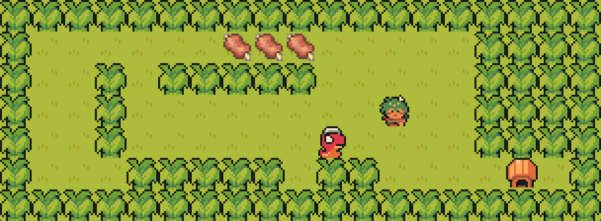
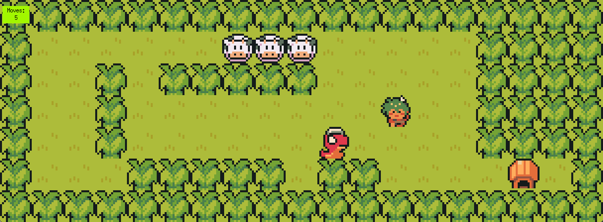

# So Long

## Mandatory


### Checks (Mandatory)

```
valgrind --leak-check=full --show-leak-kinds=all --track-origins=yes --verbose --log-file=valgrind-out.txt <executable> <args>
```

- 0 arg
- \>1 arg
- non-existent arg
- invalid extension
- empty file
- small map (row)
- small map (col)
- everything else. Edit map file on the fly. 
	- Valid elements: 1 P, 1 E, >1 C, other chars.
	- Rectangle
	- Closed by walls
	- FF


### Notes (Mandatory)
- Destroy function to terminate is critical!! Otherwise there are always leaks or errors.
- Mandatory part can accept Enemy Patrol character(s) if the element is present on map though does not do anything about it.
- ~~Prints movement already on screen instead of on terminal, because it requires only 2 lines of code.~~ Print on terminal in case evaluation needs it.
- Exit tile is walkable, just because.
- Ninja adv pack (https://pixel-boy.itch.io/ninja-adventure-asset-pack)
- Sprite cutter (https://ezgif.com/sprite-cutter)
- Upscale pixelart (https://lospec.com/pixel-art-scaler/)


## Bonus


### Notes (Bonus)
- Collectible is now cow.
- Snek, cow, and player now animates.
- If player touches snek, player dies.
- Print movements on screen.

## Retrospective Notes

### Preface
I write this only while things are still fresh in my head. I dont think I will read them again anyway, just like the other ones. 

I was at the start contemplating whether to do FdF or so_long. FdF seems very cool, but while doing preliminary research, I found out amazing pixely cow pictures that I really wanted to use (ended up using something else though). So I decided to do so_long.

It was difficult to approach the project in the beginning. I was quite ambitious wanting to actually start from scratch by watching videos and reading articles/guides/manuals. I ended up having an idea of how I want it to look in the end, a little vague idea how to start, but no idea at all how to connect the threads from start to end. Almost everything I tried by myself ended up tangling up the threads. Again, other people to the rescue, but it took **a lot** of effort to untangle the threads of other people's projects.

### Post evaluation remarks
So the evaluation was not accompanied by slides this time, for two main reasons, the first one was the consideration that the evaluation would be quite busy, screen real-estate wise, displaying the code (switching between code, terminal, map files), the evaluation page, and the game display. Adding one more thing to switch back and forth to seems too much of a clutter to an already messy monitor. The second reason was namely, I simply had neither time nor interest to explain the tangled up threads I made in this project. I dont think I will make this very detailed as well.

1. It was actually quite helpful to tackle the project into several parts. The first one was the initial check, i.e. parsing arguments. At this point nothing was done except error control on invalid arguments (no args, too many args, map file nonexistent, etc) or invalid text files (wrong extension, map file has no line, map too small, etc)

2. After passing that step, the next one is loading the map. Here the struct is initialized, not sure if it was a good idea to actually initialize everything as NULL or zero, but I did it anyway. Then the map is loaded along with dealing with other *things*, like the number of rows, number of columns (potential pitfall: map text file may be ```lf``` terminated, or ```crlf``` terminated, check vscode bottom right), # of elements ('PCE'), and most importantly, store the map array line by line (use gnl).

3. The third step was another control, to check the content of the map (array), this time for the e.g. number of elements ('P' = 1, 'E' = 1, 'C' > 1), check if map is rectangle, closed by walls ('1'), or solvable map (valid path -> use flood fill, this is a problem of its own). 

At this point, all of these steps makes it easier to properly exit the program cleanly, due to how the termination (function) works. If the first step must exit, nothing was needed to be done except writing error message. At second step, since the struct was already initiated, and some *variables* are already filled, the termination must clean the struct to avoid leaks. The third step is similar to the second, but debugging was supported by verbose error messages.

4. Passing all those steps, the fourth one is initialize the mlx. Now here the mlx pointer come into existence, along with the window pointer as well, but not including the hooks.

5. Then rendering is declared. The rendering step first loads the sprites (& store them in the struct). Then actually renders them to the window (mlx_put_image_to_window) by parsing the map array line-by-line for each element. The player 'P' is handled separately which requires another file all for the player functionality.

6. The last step is to run the mlx (loop). Here are the declaration of the hooks, etc, where one of the hooks goes (refers) to the rendering part of the program, other hooks to respond to (1.) exit by mouse-click and (2.) keypresses. The keypresses either goes to termination ('ESC') or updates player position (arrows or 'WSAD'). Some points to mention, player movement is hindered by walls, but otherwise free movement where the player sprite is moved to another tile (according to keystroke), and the tile where the player was, is refreshed by a floor tile (sprite). The exit/terminate condition (win) was met if there are no more collectibles and player moves to 'EXIT' tile. Each movement was easily printed on shell by incrementing a counter for each keystroke and just ft_printf. 

Now if anything happens and termination should occur, everything has to be "removed" including the mlx and window pointers and the sprites (xpms). This ensures a clean termination.

7. The bonus part only requires three additional things to do, namely:
	1. Termination when touching enemy patrol.
	2. Writing movement on screen.
	3. Animate somethings.

8. Displaying enemy patrol was trivial, and die-ing by touching it was also trivial, just add a condition if player touches that enemy tile. 

9. Printing movement on screen was trivial as well, just replace the line that prints movement to shell with mlx_string_put. Some display adjustments was necessary though.

10. The animation display was achieved by loading different sprites (xpms) and declaring an int variable (frame) that increments and hooked to the loop. Each increment of the frame calls a function that displays a different sprite for an animated look.

Some things that I tried/considered but was not done/successful:
1. Changing player sprite according to directions. Facing left, right, up, down. The sprites I already have, but I decided against having it to avoid a bloated project.
2. Movement of enemy patrol for the same reason and I think that (may) require another step of effort which was not very beneficial.
3. Animating player when collecting stuffs or change the exit tile when exiting the map was permittable (all stuffs are collected), but again, does not seem very beneficial to do.
4. Having layers. I first tried just pushing/putting a transparent xpm over a floor tile, but it ended up just covering the floor tile with the transparent part of the player xpm being rendered as an opaque black. There is a trick to this as explained by pulgamecanica's blog, but it seems to be too much work to do. Here every pixel of the player xpm has to be read, interpreted as transparent, then "pushed" to the floor tile. I decided to just make every xpm that I use has a floor background (manual work in GIMP), so in the end I only have one "layer" of images/display. 
