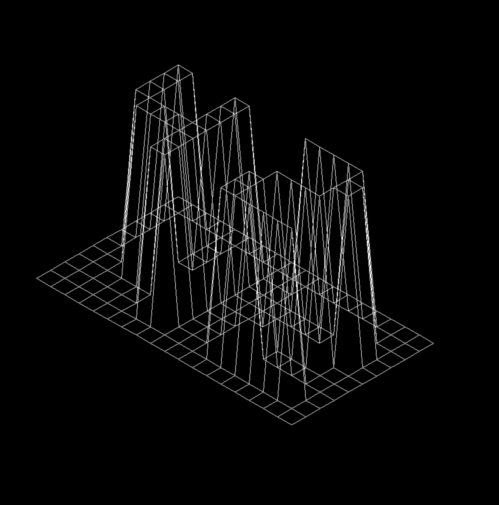

# FdF

This is the one of the first graphical projects done in school 42. The main aim of the project was to read a map containing numbers in a matrix arrangement and using them to
make a wireframe model in an isometric perspective. For the bonus part, the model needed to be zoomed, rotated, and translated smoothly.

To use and see the models, firstly clone the directory and run `make`. Then do `./fdf maps/[map].fdf` using the test maps available in the maps directory.

